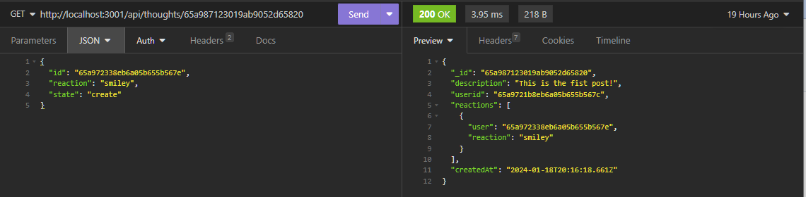

# The Social Media App by Alan Lee

### Credits
A great deal of this code was directly inspired by the EDX BootCamp's very own instructor activity on Mongo/Mongoose (Module 17 #25). While not exactly a 1:1 crossover, I would be remise to understate just how helpful that source code was in the creation of this application. I did put on some of my own flair into the mix, but the set up and execution is very similar.

## Table of Contents

[Description](#description)

[Installation](#installation)

[Usage Information](#usage-information)

[Testing Instructions](#testing-instructions)

[Deployed Website](#deployed-website)

[Questions?](#questions?)

[Contributing](#contributing)

[License](#license)

## Description 
This project is designed to give a user a deeper understanding of the monogodb structure through the mongoose ORM. You will need insomnia in order to fully utilize this project in it's current form along with maintaining a strict adherence to the restful API structure in the server. Example commands will be provided for you down below.

## Installation
N/A

## Usage Information
Anyone can use this project as long as they have Insomnia .

## Testing Instructions
In Insomnia, you can enter the following URL requests (with additional request bodies when pertinent) and get the following results

### User Commands
-  Find All Users -`(GET) http://localhost:3001/api/users/`

-  Find Specific User - `(GET) http://localhost:3001/api/users/:usersid`

-  Create User - `(POST) http://localhost:3001/api/users/`
    - Body: `JSON {"username":"string","email":"string","first":"string","last":"string"}`
    - Always leave the friendlist as an empty array when creating a new user.

-  Update User - `(PUT) http://localhost:3001/api/users/:usersid`
    - Body: Whatever you need to update in the boy. Keep the same properties as in the Create User Command.

-  Delete User - `(DELETE) http://localhost:3001/api/users/:usersid`

-  Apply Friendship - `(PUT) http://localhost:3001/api/users/friend/:usersid`
    - `Create Friend` Body: `JSON { "id": "userid", "state": "create"}`
    - `Destroy Friend` Body: `JSON { "id": "userid", "state": "destroy"}`

### Thought Commands
- Find All Thoughts - `(GET) http://localhost:3001/api/thoughts/`

- Find Specific Thought - `(GET) http://localhost:3001/api/thoughts/:thoughtid`

- Create Thought - `(POST) http://localhost:3001/api/thoughts/`
    - Body: `JSON {"description":"string","username":"string","emojis":[]}`
    - Always leave the reactions as an empty array when creating a thought.

- Update Thought - `(PUT) http://localhost:3001/api/thoughts/:thoughtid`
    - Body: Whatever you need to update in the boy. Keep the same properties as in the Create Thought Command.
    
- Delete Thought - `(DELETE) http://localhost:3001/api/thoughts/:thoughtid`

- Apply Emoji - `(PUT) http://localhost:3001/api/thoughts/emoji/:thoughtid`
    - `Create emoji` Body: `JSON { "id": "userid", "emoji": "smiley","state": "create"}`
    - `Destroy emoji` Body: `JSON { "id": "userid", "emoji": "smiley","state": "destroy"}`

- Create Reaction - `(POST) http://localhost:3001/api/thoughts/react/:thoughtId` 
    -Body : `JSON { "description": "string", "username":"string" }`

- Delete Reaction - `(DELETE) http://localhost:3001/api/thoughts/react/:thoughtId/:reactionId` 

## Walthrough Video
Link to Alan Lee's The Social Media App Youtube Walkthrough: https://youtu.be/atvjCR2FkVs

## Deployed Website 
Link to Alan Lee's The Social Media App: https://github.com/DimtheQuiet21/social-media-app

## Questions?
Please Contact Alan Lee at aflee227@gmail.com if you have additional questions.

## Contributing 
There is no way to contribute to this project.

## License 
The MIT was used for the creation and the publication of this Repository and Webpage.
